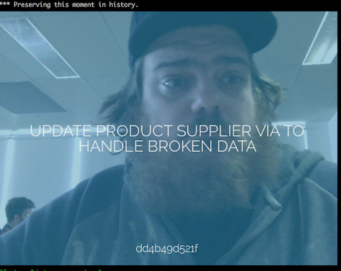

# Lolcommits Term Output

[lolcommits](https://lolcommits.github.io/) takes a snapshot with your
webcam every time you git commit code, and archives a lolcat style image
with it. Git blame has never been so much fun!

This plugin uses the [inline
image](http://iterm2.com/documentation-images.html) feature available in
[iTerm2](http://iterm2.com/index.html) to display each lolcommit (images
only) in your terminal (after committing). For example:

## Requirements

* Ruby >= 2.4
* A webcam
* [iTerm2](http://iterm2.com/index.html)
* [ImageMagick](http://www.imagemagick.org)
* [ffmpeg](https://www.ffmpeg.org) (optional) for animated gif capturing

## Installation

After installing the lolcommits gem, install this plugin with:

    $ gem install lolcommits-term_output

Then configure to enable and set the remote endpoint:

    $ lolcommits --config -p term_output
    # set enabled to `true`

That's it! Your next lolcommit will be displayed within your terminal.
To disable use:

    $ lolcommits --config -p term_output
    # and set enabled to `false`

## Development

Check out this repo and run `bin/setup`, this will install all
dependencies and generate docs. Use `bundle exec rake` to run all tests
and generate a coverage report.

You can also run `bin/console` for an interactive prompt that will allow
you to experiment with the gem code.

## Tests

MiniTest is used for testing. Run the test suite with:

    $ rake test

## Docs

Generate docs for this gem with:

    $ rake rdoc

## Troubles?

If you think something is broken or missing, please raise a new
[issue](https://github.com/lolcommits/lolcommits-term_output/issues).
Take a moment to check it hasn't been raised in the past (and possibly
closed).

## Contributing

Bug
[reports](https://github.com/lolcommits/lolcommits-term_output/issues)
and [pull
requests](https://github.com/lolcommits/lolcommits-term_output/pulls)
are welcome on GitHub.

When submitting pull requests, remember to add tests covering any new
behaviour, and ensure all tests are passing on [Travis
CI](https://travis-ci.com/lolcommits/lolcommits-term_output). Read the
[contributing
guidelines](https://github.com/lolcommits/lolcommits-term_output/blob/master/CONTRIBUTING.md)
for more details.

This project is intended to be a safe, welcoming space for
collaboration, and contributors are expected to adhere to the
[Contributor Covenant](http://contributor-covenant.org) code of conduct.
See
[here](https://github.com/lolcommits/lolcommits-term_output/blob/master/CODE_OF_CONDUCT.md)
for more details.

## License

The gem is available as open source under the terms of
[LGPL-3](https://opensource.org/licenses/LGPL-3.0).

## Links

* [Travis CI](https://travis-ci.com/lolcommits/lolcommits-term_output)
* [Code Climate](https://codeclimate.com/github/lolcommits/lolcommits-term_output)
* [Test Coverage](https://codeclimate.com/github/lolcommits/lolcommits-term_output/coverage)
* [RDoc](http://rdoc.info/projects/lolcommits/lolcommits-term_output)
* [Issues](http://github.com/lolcommits/lolcommits-term_output/issues)
* [Report a bug](http://github.com/lolcommits/lolcommits-term_output/issues/new)
* [Gem](http://rubygems.org/gems/lolcommits-term_output)
* [GitHub](https://github.com/lolcommits/lolcommits-term_output)
